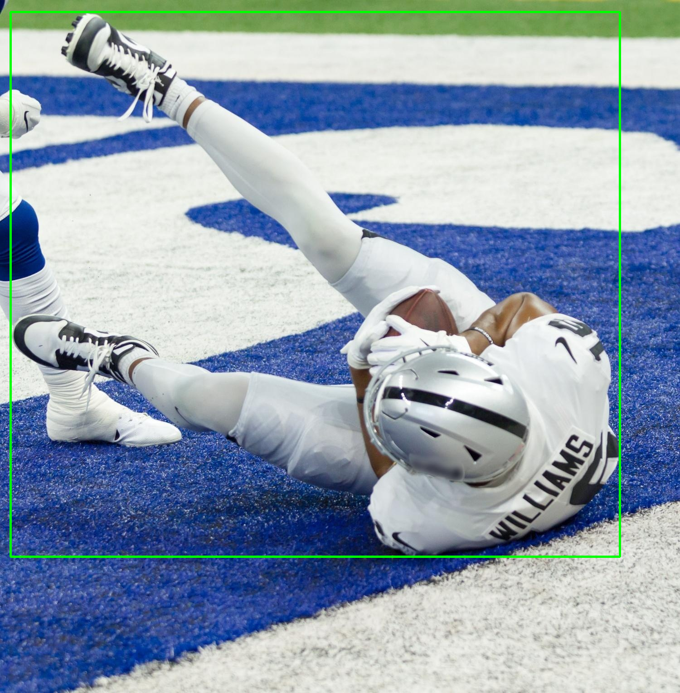
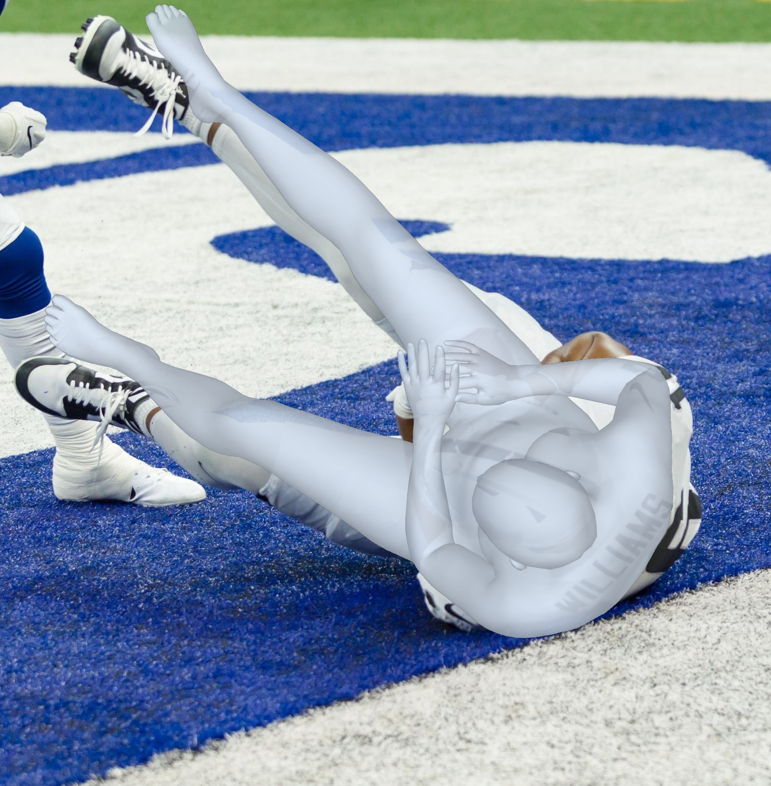
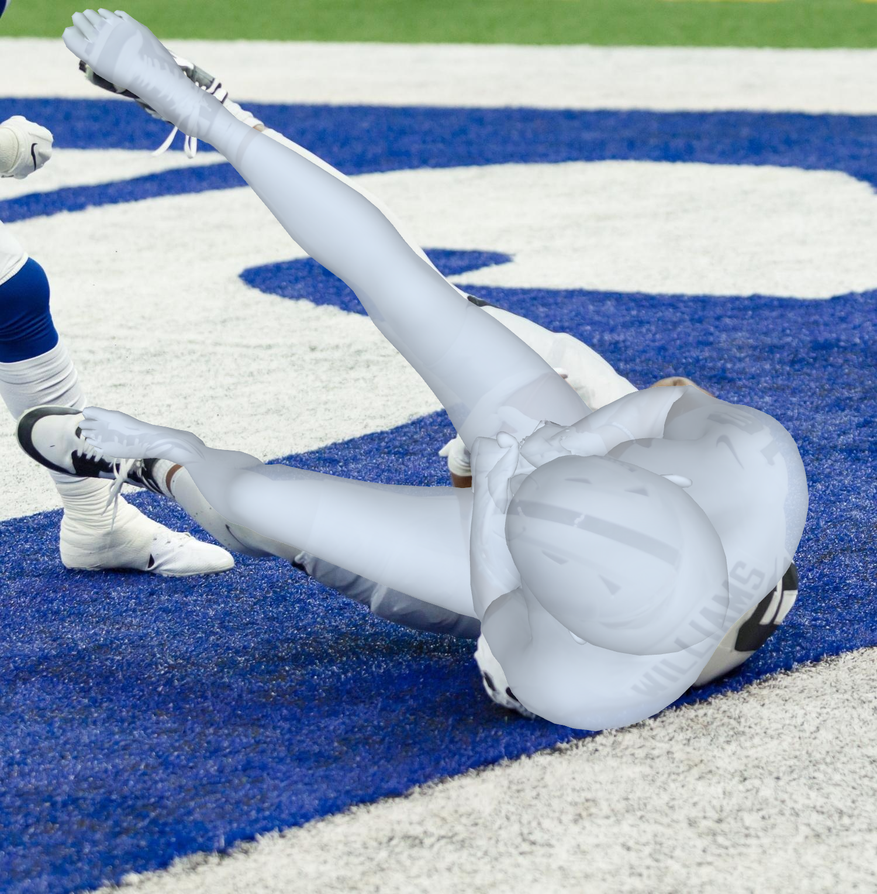
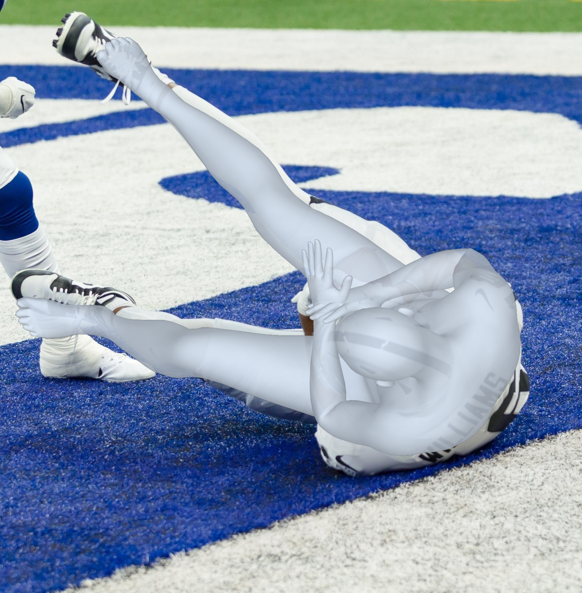

# SAM 3D Body: Robust Full-Body Human Mesh Recovery 

**[AI at Meta, FAIR](https://ai.meta.com/research/)**

[Xitong Yang](https://scholar.google.com/citations?user=k0qC-7AAAAAJ&hl=en)\*, [Devansh Kukreja](https://www.linkedin.com/in/devanshkukreja)\*, [Don Pinkus](https://www.linkedin.com/in/don-pinkus-9140702a)\*, [Taosha Fan](https://scholar.google.com/citations?user=3PJeg1wAAAAJ&hl=en), [David Park](https://jindapark.github.io/), [Soyong Shin](https://yohanshin.github.io/), [Jinkun Cao](https://www.jinkuncao.com/), [Jiawei Liu](https://jia-wei-liu.github.io/), [Nicolas Ugrinovic](https://www.iri.upc.edu/people/nugrinovic/), [Anushka Sagar](https://www.linkedin.com/in/anushkasagar)†, [Jitendra Malik](https://people.eecs.berkeley.edu/~malik/)†, [Piotr Dollar](https://pdollar.github.io/)†, [Kris Kitani](https://kriskitani.github.io/)†

*Core contributors, †Project leads

[[`<REPLACE ME Paper>`](https://ai.meta.com/research/publications/sam-2-segment-anything-in-images-and-videos/)] [[`<REPLACE ME Project>`](https://ai.meta.com/sam2)] [[`<REPLACE ME Demo>`](https://sam2.metademolab.com/)] [[`<Dataset>`](https://huggingface.co/datasets/facebook/sam-3d-body-dataset)] [[`<REPLACE ME Blog>`](https://ai.meta.com/blog/segment-anything-2)] [[`<REPLACE ME BibTeX>`](#citing-sam-2)]


**SAM 3D Body (3DB)** is a robust promptable foundation model for single-image full-body 3D human mesh recovery (HMR). Our method emphasizes data quality and diversity to maximize performance. We utilize the Momentum Human Rig (MHR), a new parametric mesh representation that decouples skeletal pose and body shape for improved accuracy and interpretability.

3DB employs an encoder-decoder architecture and supports auxiliary prompts, including 2D keypoints and masks, enabling user-guided inference similar to the SAM family of models. We derive high-quality annotations from a multi-stage annotation pipeline using differentiable optimization, multi-view geometry, dense keypoint detection, and a data engine to collect and annotated data covering both common and rare poses across a wide range of viewpoints.

## Visual Comparisons  [TODO: Jiawei and David Please Update this]

<table>
<thead>
<tr>
<th align="center">Input</th>
<th align="center"><strong>SAM 3D Body</strong></th>
<th align="center">CameraHMR</th>
<th align="center">NLF</th>
<th align="center">HMR2.0b</th>
</tr>
</thead>
<tbody>
<tr>
<td align="center"></td>
<td align="center"></td>
<td align="center"></td>
<td align="center"></td>
<td align="center"></td>
</tr>
<tr>
<td align="center"></td>
<td align="center"></td>
<td align="center"></td>
<td align="center"></td>
<td align="center"></td>
</tr>
<tr>
<td align="center"></td>
<td align="center"></td>
<td align="center"></td>
<td align="center"></td>
<td align="center"></td>
</tr>
<tr>
<td align="center"></td>
<td align="center"></td>
<td align="center"></td>
<td align="center"></td>
<td align="center"></td>
</tr>
</tbody>
</table>

*Our SAM 3D Body demonstrates superior reconstruction quality with more accurate pose estimation, better shape recovery, and improved handling of occlusions and challenging viewpoints compared to existing approaches.*

## Latest updates

**11/19/2025 -- Checkpoints Launched, Dataset Released, Web Demo and Paper are out**
- < MORE DETAILS HERE >

## Installation  [TODO: Taosha and David Please Confirm this]
See [Install.md](INSTALL.md)

## Usage - Inference

Models can be loaded directly from [Hugging Face]

```python
from sam_3d_body import build_sam_3d_body_hf

model = build_sam_3d_body_hf("facebook/sam-3d-body-vith")
outputs = model.process_one_image("path/to/image.jpg")
```

Available models on HuggingFace:
- `sam-3d-body-vith`
- `sam-3d-body-dinov3`
- `sam-3d-body-vitl`

## Usage - Fine-Tuning and Research

### Download checkpoints
```
huggingface-cli download facebook/sam-3d-body-vith --local-dir checkpoints/sam-3d-body-vith
huggingface-cli download facebook/sam-3d-body-dinov3 --local-dir checkpoints/sam-3d-body-dinov3
huggingface-cli download facebook/sam-3d-body-vitl --local-dir checkpoints/sam-3d-body-vitl
```

### Load the model directly
```
model = build_sam_3d_body_model(
    checkpoint_path: str = "checkpoints/last.ckpt",
    proto_path: str = "checkpoints/assets/")
```

## Model Description

### SAM 3D Body checkpoints [TODO: Xitong Please Update this]

The table below shows the SAM 3D Body checkpoints released on [TODO: Update this].

|      **Model**       | **Size (M)** |    **Speed (FPS)**     | **H36M test (MPJPE)** | **3DPW test (MPJPE)** |
| :------------------: | :----------: | :--------------------: | :-----------------: | :----------------: |
|   sam_3d_body <br /> ([config](https://huggingface.co/facebook/sam-3d-body/blob/main/model_config.yaml), [checkpoint](https://huggingface.co/facebook/sam-3d-body))    |     TBD     |          TBD          |        TBD         |        TBD        |
|   sam_3d_body_small <br /> ([config](https://huggingface.co/facebook/sam-3d-body-small/blob/main/model_config.yaml), [checkpoint](https://huggingface.co/facebook/sam-3d-body-fast))   |      TBD      |          TBD          |        TBD         |        TBD        |


< TODO: Update when we run speedtests >
Speed measured on an A100 with `torch 2.5.1, cuda 12.4`. See `benchmark.py` for an example on benchmarking (compiling all the model components). Compiling only the image encoder can be more flexible and also provide (a smaller) speed-up (set `compile_image_encoder: True` in the config).

## SAM 3D Body Dataset
The SAM 3D Body data is released in [Hugging Face](https://huggingface.co/datasets/facebook/sam-3d-body-dataset). Please follow the [instructions](./data/README.md) to download and process the data.


### Dataset Loading

## License

The SAM 3D Body model checkpoints and code are licensed under [SAM License](./LICENSE).

## Contributing

See [contributing](CONTRIBUTING.md) and the [code of conduct](CODE_OF_CONDUCT.md).

## Contributors

The SAM 3D Body project was made possible with the help of many contributors:
Vivian Lee, George Orlin, Matt Feiszli, Nikhila Ravi, Andrew Westbury, Jyun-Ting Song, Zejia Weng, Xizi Zhang, Yuting Ye, Federica Bogo, Ronald Mallet, Ahmed Osman, Rawal Khirodkar, Javier Romero, Carsten Stoll, Juan Carlos Guzman, Sofien Bouaziz, Yuan Dong, Su Zhaoen, Fabian Prada, Alexander Richard, Michael Zollhoefer, Roman Rädle, Sasha Mitts, Michelle Chan, Yael Yungster, Azita Shokrpour, Helen Klein, Mallika Malhotra, Ida Cheng, Eva Galper.

Third-party code: detectron2, and more? [TODO: Xitong Please Update this]

## Citing SAM 3D Body [TODO: Update this]

If you use SAM 3D Body or the SAM 3D Body dataset in your research, please use the following BibTeX entry.

```bibtex
@article{yang2025sam3dbody,
  title={SAM 3D Body: Single Image Human Mesh Recovery},
  author={Yang, Xitong and Kukreja, Devansh and Pinkus, Don and Fan, Taosha and Park, David and Shin, Soyong and Cao, Jinkun and Liu, Jiawei and Ugrinovic, Nicolas and Sagar, Anushka and Malik, Jitendra and Dollar, Piotr and Kitani, Kris},
  journal={arXiv preprint arXiv:XXXX.XXXXX},
  year={2025}
}
```
